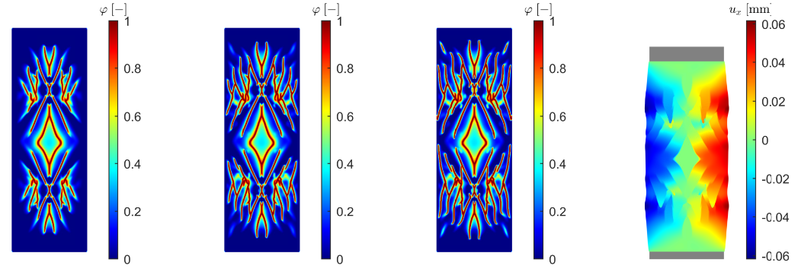
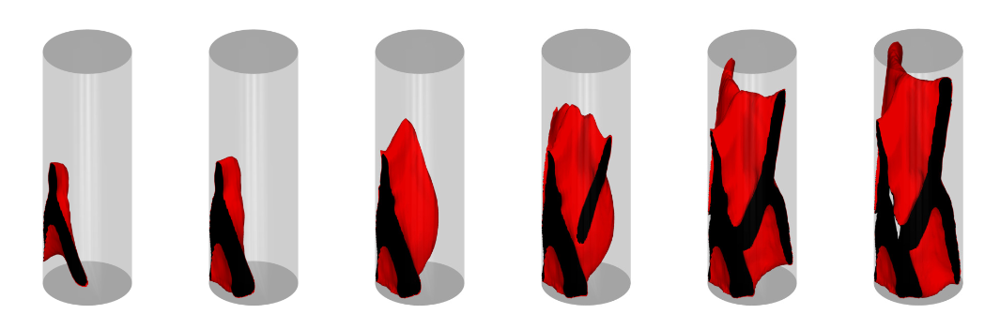

#  IceFEM: A finite element code to simulate fracture and viscous/plastic deformation in ice

[](https://opensource.org/licenses/MIT)

Note: This repository is modified from the code for the following paper: 
> T. Hageman, *Phase-field fracture modelling of ice: From triaxial tests to ice-cliff collapse*, Computer Methods in Applied Mechanics and Engineering, 2026. https://doi.org/10.1016/j.cma.2026.118857


## Overview

IceFEM is a parallel finite element code designed for high-fidelity simulation of ice mechanics, including:
- **Phase-field fracture modeling** for capturing crack propagation and ice failure
- **Viscous and plastic deformation** using advanced constitutive models
- **Thermal effects** and heat transfer in ice systems
- **Large-scale simulations** with MPI parallelization using PETSc

The code is particularly suited for studying ice cliff collapse, crevasse formation, ice shelf dynamics, and triaxial compression tests on ice samples.


## Features

- **Flexible Element Types**: Support for various 2D and 3D element formulations
- **Advanced Material Models**: Viscoplastic Glen's law, elastic-brittle behavior, phase-field fracture
- **Parallel Computing**: MPI-based parallelization for efficient large-scale simulations
- **Multiple Physics**: Coupled thermomechanical, and fracture models
- **HDF5 Output**: Efficient data storage and restart capabilities
- **JSON Input**: Easy-to-configure simulation parameters
- **VTK Visualization**: Visualization while simulations are ongoing, and output files compatible with a range of post-processing options

## Table of Contents

- [Installation](#installation)
  - [Prerequisites](#prerequisites)
  - [Dockerfile](#dockerfile)
- [Usage](#usage)
  - [Basic Example](#basic-example)
  - [Running Test Cases](#running-test-cases)
  - [Parallel Execution](#parallel-execution)
- [Project Structure](#project-structure)
- [Configuration](#configuration)
- [Documentation](#documentation)
- [Citation](#citation)
- [Contributing](#contributing)
- [License](#license)
- [Contact](#contact)

## Installation

### Prerequisites

- **C++ Compiler**
- **MPI**: OpenMPI or MPICH for parallel execution
- **CMake**
- **PETSc**: Portable, Extensible Toolkit for Scientific Computation
- **VTK**: Visualization Toolkit (optional, only required for visualization during runtime)
- **HDF5**: High-performance data storage
- **Eigen3**: Linear algebra library
- **RapidJSON**: JSON parsing library
- **HighFive**: C++ HDF5 wrapper
- **IgaFEM**: MATLAB library for generating IGA meshes (https://sourceforge.net/projects/cmcodes/)
- **MATLAB**: Dependencies I have found so far
  - Image Processing Toolbox
  - Parallel Computing Toolbox

### Using IceFEM with Docker

If you would like to run IceFEM in a Docker container, there are two Dockerfiles in this repository (created with substantial help from Justin Linick). The first Dockerfile builds a "slim" base image with all the dependencies of IceFEM installed, and the other Dockerfile adds MATLAB on top of the IceFEM image for mesh generation purposes. Once the meshes are generated, you should be able to just use the base image (I think. Heavy caveat on "I think"). Fair warning, these images are quite large due to all the dependencies installed, and take a long time to build.

Unfortunately MATLAB requires licensing to use. This requires an extra step when setting up the icefem:matlab image. First, run a container using the following docker run command:

```
docker run --rm -it <image_name> matlab -licmode onlinelicensing
```

This will then prompt you to sign in to your MATLAB account. Once you have successfully signed in, run the following docker commit command to save the changes to a new image:

```
docker commit <container_id> <new_image_name>
```

This will now allow you to access the container without needing to log in every time. 
**NOTE 1**: In order to run the TestCases, you will need to confirm the path to IgaFEM in the mesh generations files is correct for your install. Assuming you're using the Dockerfile, I don't think you'll need to change the path? But just something to be aware of. My lack of coding skills mean I have no clue how to not have the path be anything other than hard coded 😬
**NOTE 2**: You might need to add the flag `--platform linux/amd64` in the run command. I also lack the coding skills to figure out why
**NOTE 3**: If you need to install any additional MATLAB toolboxes, add the name of the toolbox from the mpm_input_r2024a.txt file to the ADDITIONAL_PRODUCTS arg in the MATLAB Dockerfile

## Usage

### Basic Example

After building, the executable `IceCode` will be in the build directory. Run a simulation using:

```bash
./IceCode path/to/input.json
```

### Running Test Cases

Several test cases are provided in the `TestCases/` directory. Before running test cases, you must generate the mesh for the test case using the generate_tmesh or GenerateMesh files available in the MeshGen folders of each test case.

**2D Triaxial Compression Test**:
```bash
./IceCode ./TestCases/TriAxialCompression/TriAxial2D.json
```



**3D Triaxial Compression Test**:
```bash
./IceCode ./TestCases/TriAxialCompression/TriAxial.json
```



**Ice Cliff Collapse Simulation**:
```bash
./IceCode ./TestCases/IceCliffs/IceCliff.json
```

### Parallel Execution

For parallel simulations using MPI:

```bash
mpirun -np 8 ./IceCode ./TestCases/IceCliffs/IceCliff.json
```

Replace `8` with the desired number of processors. 

### Output and Visualization

Results are saved in the `Results/` directory as HDF5 files:
- `results_*.hdf5`: Field data at each output time step
- `mesh_*.hdf5`: Mesh geometry and topology
- `Backup*.hdf5`: Restart files for continuing simulations

Use the included MATLAB scripts, or a custom HDF5 reader to visualize the results.

## Project Structure

```
Ice_FEM_2025a/
├── main.cpp                    # Main entry point
├── CMakeLists.txt              # Build configuration
├── Install_ICEFEM.sh           # Installation script
├── mesh/                       # Mesh handling
│   ├── ElementTypes/           # Element formulations (Quad, Hex, etc.)
│   └── Groups/                 # Element and node groups
├── Physics/                    # Core physics modules
├── Models/                     # Constitutive models and physics
│   ├── LinearElastic/          # Linear elasticity
│   ├── Fracture/               # Phase-field fracture
│   ├── PoroElasticity/         # Porous media mechanics
│   ├── Thermal/                # Heat transfer
│   └── Materials/              # Material definitions
├── Solvers/                    # Linear and nonlinear solvers
├── InputsOutputs/              # I/O handling
├── TestCases/                  # Example simulations
│   ├── TriAxialCompression/    # Triaxial test setup
│   └── IceCliffs/              # Ice cliff collapse
├── utility/                    # Utility functions
├── Documentation/              # LaTeX documentation
└── Results/                    # Simulation output directory
```

## Configuration

Simulations are configured using JSON input files. Key sections include:

- **Mesh**: Geometry definition, element types, boundary groups
- **Physics**: Active models (mechanical, thermal, fracture)
- **Materials**: Material properties (elastic moduli, viscosity, etc.)
- **Boundary Conditions**: Displacements, forces, temperature constraints
- **Time Stepping**: Time integration scheme, step size, duration
- **Output**: Frequency and fields to save


See the `TestCases/` directory for complete examples.

## Documentation

For detailed information about the implementation details, and advanced usage, please refer to:
- **[Full Documentation (PDF)](Documentation/Doc.pdf)**

## Citation

If you use IceFEM in your research or work, please cite the following paper:

```bibtex
@article{Hageman_2026,
 title={Phase-field fracture modelling of ice: From triaxial tests to ice-cliff collapse},
 volume={454},
 url={http://dx.doi.org/10.1016/j.cma.2026.118857},
 DOI={10.1016/j.cma.2026.118857},
 journal={Computer Methods in Applied Mechanics and Engineering},
 publisher={Elsevier BV},
 author={Hageman, Tim},
 year={2026},
 month=june,
 pages={118857},
 language={en} }
```
---

**Note**: This code is provided for research purposes, and is provided as-is. While care has been taken to verify the simulation results, the author is not responsible for any unintended errors in the code. For detailed theoretical background and validation, please consult the associated publication.
